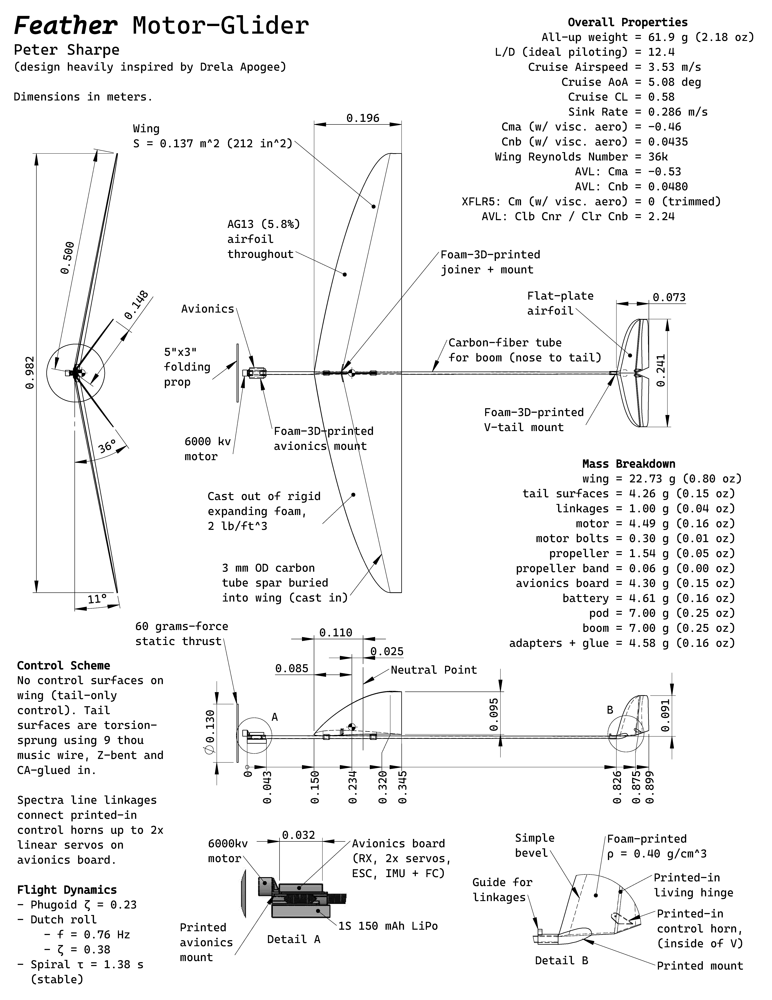
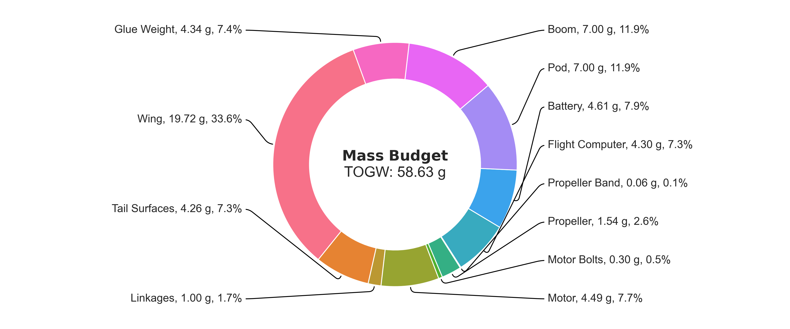

# Feather

by Peter Sharpe

-----

**Feather is a 1-meter-wingspan RC glider with an all-up weight of around 60 grams.**

It's optimized to achieve the lowest possible sink-rate in still-air cruise flight, in order to maximize flight duration during calm early mornings and its ability to exploit low-altitude thermals for lift.

## Conceptual Design Considerations

Remote-controlled gliders in this size range typically fall into one of two categories:

- Hand-launch gliders (HLG), which are thrown "javelin-style" (like a football, but without the spiral)
- Discus-launch gliders (DLG), which are launched by holding the glider by a wingtip and spinning your whole body in a circle (about the airplane's yaw axis), then releasing.

Discus-launch gliders can [achieve some truly unbelievable launch altitudes](https://www.youtube.com/watch?v=onFAnlK0M_4&t=24s) (up to 70 meters, for the pros). This has several key benefits:

1. Higher launch altitude means longer flight times, assuming a constant sink-rate.
2. Higher launch altitude means more time to find thermals.
3. At higher altitude, thermals are typically wider and have longer durations before dissipating.
4. At higher altitude, thermals are typically stronger in magnitude. This is because the ground effectively acts as a no-penetration boundary condition for the 3D wind field, so getting farther away from the ground increases updraft and downdraft magnitudes. (Note: this is only true at relatively low altitudes, roughly <1 km, for complicated reasons that are beyond scope here...)

But, discus-launch gliders have some significant drawbacks, all of which are associated with their violent launch conditions:

1. The wing structural weight must be much higher (sometimes double what they would be for hand-launch gliders) to support the high launch forces, which can sometimes be as much as 30 G.
2. Tailbooms must be much stiffer (read: heavier) to support the high yaw moment during launch as the airplane goes from spinning to straight flight.
3. The design space for tail geometries is constrained by the need to minimize fuselage boom torsion. For example, a V-tail is typically undesirable, because the side force on the tail surfaces would cause excessive boom torsion. This results in lost performance at cruise.
4. Vertical stabilizers typically use asymmetric airfoils in order to deal with the high vertical stabilizer lift coefficient during launch de-rotation. This results in lost performance at cruise.

Basically, DLGs launch higher than HLGs, but they are heavier and less efficient at cruise.

-----

Feather aims to do something else, to combine the best parts of a DLG with the best parts of a HLG. 

In recent years, electric powertrains have gotten so lightweight and integrated that it may be possible to achieve the same launch altitude as a DLG, but without any of the launch-force constraints.

Specifically, Feather uses a BLDC motor + propeller to get up to altitude, and then shuts off its powertrain to glide - it's your typical motor glider, but at an unprecedentedly-small scale.

Feather is essentially built around [this powertrain](https://www.buzzardmodels.com/4gram1spro-brick), which is a pretty magical piece of technology. In short:

For 15.3 grams, you get:

- A 1S 3.7V 150mAh LiPo battery
- A 5-amp ESC for a BLDC motor
- An EX1103-6000kv BLDC motor
- A 5x3 propeller
- Two BM5320 linear servos
- An IMU + flight controller for PID stabilization to the servos
- A FrSky-compatible RC receiver

which is pretty nuts. Given that the battery + receiver + 2 servos of a typical 1-meter DLG would weigh ~20 grams, we're essentially getting an entire powertrain for free, plus an additional 5 grams weight savings.

The lack of a launch means we can build the main structural elements (wing and tailboom) much, much lighter, leading to **Feather's overall all-up weight of around 60 grams**. This compares to typical 1-meter-wingspan DLGs, the lightest of which weigh around 100 grams (assuming highest-end modern molded composite construction, etc.).

## Detailed Design Considerations

Section to be written...

## Build Progress

All components manufactured, except for the wing itself. 

### Wing

The manufacturing process for wings cast out of foam is a bit of a black art, so a lot of experimentation is needed to get it right:

#### Attempt 1

Under-expanded, although foam is rigid, the wing is very light, and the surface finish is promising. Casting into a set of PETG 3d-printed molds, which are sanded to a 1000-grit finish (surprisingly, this only takes a few minutes with the right power tools!) and wax-coated.

Release was tough.

#### Attempt 2

In addition to wax, I also added PVA as a release agent for this attempt. That worked great.

Added more foam to prevent under-expansion, but I erred a bit on the opposite side. The force of the expanding foam was
so much that it forced the two halves of the mold apart (which was only held together by ~40 lbs of weights), resulting in the wrong outer mold line.

Surface finish is acceptable (would need some sanding). As a consequence of too much foam, the wing is a bit heavy (~35 grams). Quite stiff, though.

#### Attempt 3

To be done, but changes will include:
- Splitting the difference between the two foam amounts, to hopefully neither under- nor over-expand.
- Clamping the mold using C-clamps rather than weights, to prevent the mold from opening up in the event of over-expansion (there is a release hole in the mold).